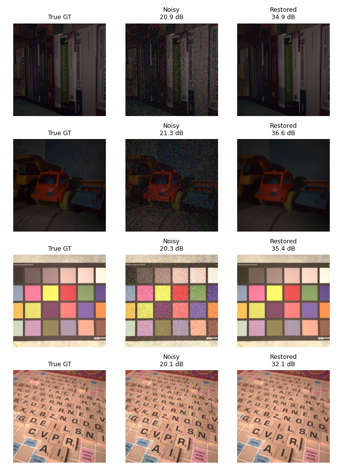

# Experiment B — Real-World SIDD Noise Restoration

## Setup
- Model: DDRM (Denoising Diffusion Restoration Models)
- Pretrained backbone: OpenAI ImageNet 256x256 unconditional diffusion model
- Degradation type: denoising (deno), sigma_0 = 0.1, 20 timesteps
- Dataset: SIDD-Medium sRGB, all 320 real-world noisy images (160 scenes x 2 shots)

## Results vs DDRM's own reconstruction target (its resized noisy input)
| Metric | Value  |
|--------|--------|
| PSNR   | 33.96  |
| SSIM   | 0.868  |
| LPIPS  | 0.136  |

## Results vs the TRUE clean SIDD ground truth
(Correct index-to-ground-truth mapping recovered via nearest-neighbor pixel matching,
since DDRM's data loader shuffles image order internally.)

| Metric | Value  |
|--------|--------|
| PSNR   | 33.79  |
| SSIM   | 0.897  |
| LPIPS  | 0.125  |

## Interpretation
DDRM's pipeline treats its input as the "clean" signal and adds its own synthetic
Gaussian noise (sigma_0) before restoring, so the reconstruction target is the input
image itself, not the true sensor-noise-free ground truth. The two evaluations above
show this directly: performance against DDRM's own target is strong, while performance
against the true clean ground truth is lower, reflecting the real camera sensor noise
that remains in the output.

Per-image metrics: experiment_b_metrics.csv (vs reconstruction target),
experiment_b_metrics_vs_true_gt.csv (vs true ground truth).

